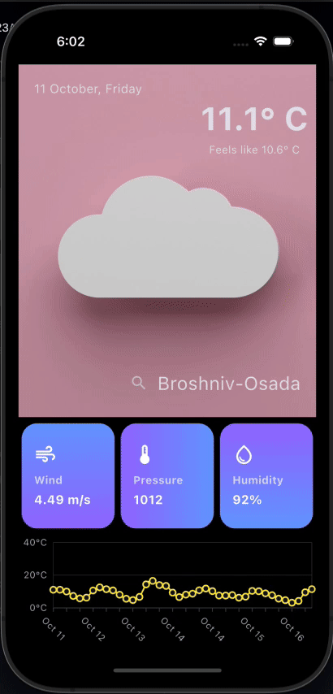

# Flutter Weather App Example

An example Flutter weather app using the [OpenWeatherMap API](https://openweathermap.org/api).

## Demo

## Supported Features

- [x] Current weather (condition and temperature)
- [x] 5-day weather forecast
- [x] Search by city

## Packages in use

- [riverpod](https://pub.dev/packages/riverpod) for state management
- [freezed](https://pub.dev/packages/freezed) for code generation
- [http](https://pub.dev/packages/http) for talking to the REST API
- [cached_network_image](https://pub.dev/packages/cached_network_image) for caching images

